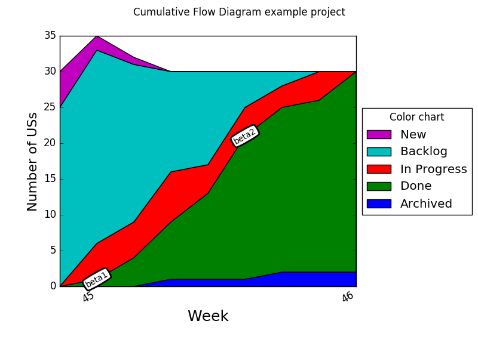

# Taiga Statistics Tool

This is a script for all you "Kanban masters" who use Taiga and are interested in visualizing progress and generate some automated statistics.

# Features

```console
$ taiga-stats --help
usage: taiga-stats [-h] [--url URL] [--auth-token AUTH_TOKEN]
                   {config_template,list_projects,burnup,store_daily,cfd,deps,deps_dot}
                   ...

Taiga statistic tool. Default values for many options can be set config file;
see the command 'config_template'.

positional arguments:
  {config_template,list_projects,burnup,store_daily,cfd,deps,deps_dot}
                        Commands. Run $(taiga-stats <command> -h) for more
                        info about a command.
    config_template     Generate a template configuration file.
    list_projects       List all found project IDs and names on the server
                        that you have access to read.
    burnup              Print burn(up|down) statistics. Typically used for
                        entering in an Excel sheet or such that plots a bunup.
    store_daily         Store the current state of a project on file so that
                        the cfd command can generate a diagram with this data.
    cfd                 Generate a Cumulative Flow Diagram from stored data.
    deps                Print user stories in .dot file format.
    deps_dot            Print US in .dot file format with dependencies too!
                        Create a custom attribute for User Stories named
                        'Depends On' by going to Settings>Attributes>Custom
                        Fields. Then go to a User Story and put in a comma
                        separated list of stories that this story depends on
                        e.g. '#123,#456'. How to generate a PNG file from
                        output: $ unflatten -l1 -c5 a.dot | dot -T png -o
                        a.png

optional arguments:
  -h, --help            show this help message and exit
  --url URL             URL to Taiga server.
  --auth-token AUTH_TOKEN
                        Authentication token. Instructions on how to get one
                        is found at https://taigaio.github.io/taiga-
                        doc/dist/api.html#_authentication
```

## Cumulative Flow Diagram

From a [CFD](http://brodzinski.com/2013/07/cumulative-flow-diagram.html) a lot of interesting insights about your team's progress [can be found](http://paulklipp.com/images/Interpreting_a_Cumulative_Flow_Diagram.jpg). However I'm not found of repetive work like counting and enterying numbers in an Excel sheet. This had to be automated! Therefore I deiced to write this script to save data on a daily basis with a cron job and a function for generating this diagram. This diagram can the be put on a TV visible in the hallways.


This is an example diagram generated from [mock data](cfd_example.dat):




To save the data and generate the diagram each working day I have this cronjob:

```console
$ crontab -l | grep taiga
0 18 * * 1-5            $HOME/bin/taiga-stats_cron.sh
```

and the script `taiga-stats_cron.sh`:

```bash
#!/usr/bin/env sh

source $HOME/dev/virtualenvs/py3env/bin/activate
cd $HOME/dev/taiga-stats

./taiga-stats store_daily --tag some_feature_tag
./taiga-stats cfd --tag some_feature_tag
```


# Setup

## Virtual environment (optional)

It is recommended to use virtual environment to not pollute your system.

```console
$ sudo apt-get install python3-dev
$ cd some/dev/dir
$ virtualenv -p /usr/bin/python3 py3env
$ source py3env/bin/activate
```

## Dependencies

Use either

pip (recommended)

```console
$ pip install -r requirements.txt
```

or setuptools

```console
$ python setup.py install
```

## Taiga-stats

```console
$ git clone https://github.com/erikw/taiga-stats.git
$ cd taiga-stats
$ ./taiga-stats -h
```
